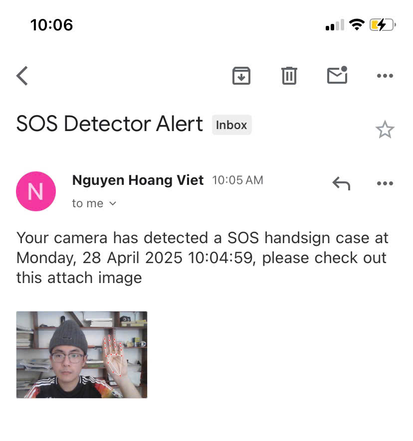

# SOS Hand Gesture Detection System

This project implements a real-time hand gesture detection system capable of recognizing the SOS signal (distress signal) in a video stream. The system leverages Mediapipe's hand tracking capabilities and integrates email notifications for alerting in case of emergencies.

<p align="center">
  <br/>
  <i>SOS hand gesture detection in action</i>
</p>

<p align="center">
  <br/>
  <i>Email notification example</i>
</p>

## Project Structure

The project is organized into the following components:

- **`detector/`**: Contains the core logic for SOS hand gesture detection.
  - `sos_logic.py`: Implements the SOS detection logic.
  - `stages.py`: Defines the stages of the SOS gesture sequence.
- **`services/`**: Provides supporting services.
  - `detection_service.py`: Handles real-time video processing and SOS detection.
  - `message_service.py`: Manages email notifications.
- **`utils/`**: Utility functions for image processing.
  - `image_utils.py`: Functions for saving and annotating images.
- **`config/`**: Configuration settings for the project.
  - `settings.py`: Contains adjustable parameters like detection confidence and save directory.
- **`demo/`**: Contains demo assets such as GIFs and images.
- **`detected/`**: Stores screenshots of detected SOS gestures.

## Features

- **Real-time hand gesture detection**: Utilizes Mediapipe's hand tracking for accurate and efficient gesture recognition.
- **SOS signal recognition**: Specifically designed to detect the SOS hand gesture sequence.
- **Image capture**: Captures a screenshot of the moment the SOS signal is detected.
- **Email notifications**: Sends alerts with the captured image to a specified email address.
- **Configurable settings**: Allows customization of detection parameters and notification settings.

## Prerequisites

- Python 3.10 or higher
- Required Python packages (see `requirements.txt`)

## Installation

1. Clone the repository:
   ```bash
   git clone <repository_url>
   cd SOS
   ```

2. Install dependencies:
   ```bash
   pip install -r requirements.txt
   ```

3. Configure environment variables:
   - Copy the `.env.template` file to `.env`:
     ```bash
     cp .env.template .env
     ```
   - Update the `.env` file with your credentials (**IMPORTANT**):
     ```env
     BREVO_API_KEY=<your_brevo_api_key>
     EMAIL_TO=<recipient_email>
     EMAIL_FROM=<sender_email>
     SENDER_NAME=<sender_name>
     ```

## Usage

1. Run the detection service:
   ```bash
   python main.py
   ```

2. Perform the SOS gesture sequence in front of your webcam:
   - **Stage 1**: All fingers open.
   - **Stage 2**: Thumb folds, other fingers remain open.
   - **Stage 3**: All fingers fold over the thumb.
   - **Stage 2**: Thumb folds, other fingers remain open again.

3. Upon successful detection:
   - A screenshot will be saved in the `detected/` directory.
   - An email notification will be sent to the configured recipient. (If you set the parameter `send_email` to `True`)

## Configuration

- **Detection Parameters**: Adjust detection and tracking confidence in `config/settings.py`:
  ```python
  DETECTION_CONFIDENCE = 0.7
  TRACKING_CONFIDENCE = 0.5
  SAVE_DIR = "./detected"
  ```

- **Environment Variables**: Set up email notification credentials in the `.env` file.

## Future Improvements

- **Advanced hand tracking models**: Explore more robust models for improved accuracy.
- **Speech recognition**: Add support for verbal SOS triggers.
- **Location tracking**: Integrate GPS for precise location information.
- **Device integration**: Extend functionality to smartwatches or mobile devices.

## Disclaimer

This project is for demonstration purposes only and should not be used as a substitute for professional security or emergency services. Always contact emergency services directly in case of an actual emergency.
